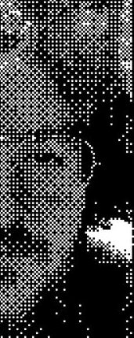

<!-- Unlike posts, top-level pages will not auto-generate an <h1> title. -->

# About

<small>Me, 2024.</small>

## Why?

I'm sick of social media and I wanted an outlet for my thoughts and opinions on the things I'm passionate about. I know writing a [small web](https://web.archive.org/web/20230402091636/https://smallweb.page/why) blog can be a bit like screaming into the void, but at least it's **_my_** void.

## How?

This blog is authored by [Daniel](mailto:daniel@ficd.ca), written in [markdown](https://www.markdownguide.org/) using [Neovim](https://neovim.io/), built with [Zoner](https://sr.ht/~ryantrawick/zoner/), and automatically deployed through a public [GitHub](https://github.com/ficcdaf/ficd-blog) repository to [Neocities](https://neocities.org/).

## Education

I have a Bachelor's of Computing (Honours), and I am currently working on my Master's of Science researching Cyber Security at the [Computer Security Research Lab](https://csrl.info/). My research is connected to securing FIDO Passkey Authentication against real-time phishing attacks.

## Resume/CV

<small>This section is a placeholder. I am working on a way to integrate my resume into this site in a way that respects my privacy.</small>

## Contact Me

You are more than welcome to e-mail me at [daniel@ficd.ca](mailto:d@ficd.ca). If you have [Proton](https://proton.me/), we can communicate via end-to-end encryption.
