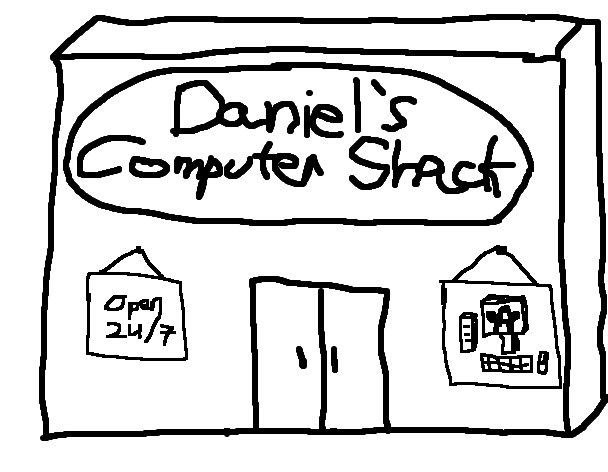

# Welcome to Daniel's Computer Shack

Hello, dear guest! My name is Daniel, and thank you for visiting my tiny corner of the internet! It may not be fancy, it may not be dynamic, but it's mine, and I'm glad you're here.

On this blog, you can expect to read about:

- Linux & FOSS
- Programming
- Cyber Security & Privacy
- Computing Ethics
- Other Cool Stuff

## TL;DR [About Me](./about)

- Master's student studying Cyber Security
- Linux nerd 🐧
- [Small Web](https://web.archive.org/web/20230402091636/https://smallweb.page/why) citizen
- Privacy advocate
- Has lots of opinions
- Likes to write about them
- Hopes that you enjoy your stay :)

## Recent Posts

<!-- An <archive> tag with a count attribute will show that count of the most recent posts! For a "more posts" button add a more attribute with your archive link. -->

<archive count="4" more="./archive"></archive>

<!-- The "more posts" button will not appear if there are fewer or equal posts to the count attribute. -->

<small>Note: This blog is automatically built and deployed through GitHub. If there are any issues, please contact me!</small>
